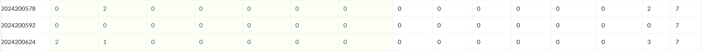

# bomblab 报告

姓名：林思源

学号：2024200592

| 总分 | phase_1 | phase_2 | phase_3 | phase_4 | phase_5 | phase_6 | secret_phase |
| --------- | ------------- | ------------- | ------------- | ----------------- |-----------|-----------|-----------|
| 7       | 0           | 0            | 0            | 0 |0  |0  |0  |


scoreboard 截图：



<!-- TODO: 用一个scoreboard的截图，本地图片，放到 imgs 文件夹下，不要用这个 github，pandoc 解析可能有问题 -->

## 解题报告

<!-- 对你拆掉的每个phase进行分析，并写出你得出答案的历程 -->

<!-- 如果能用伪代码还原题目源代码最佳（不属于先前提到的大段代码），语言描述自己的分析也可，每道题目的图片不建议超过两张 -->

### phase_1

```c
Saiverd loclken a wethd, lafz fomdra Lay, Iliffzidra.
```
```
0000000000001435 <phase_1>:
    1435:	48 83 ec 08          	sub    $0x8,%rsp  
    1439:	48 8d 35 40 1d 00 00 	lea    0x1d40(%rip),%rsi     
    1440:	e8 0e 08 00 00       call   1c53 <strings_not_equal>  
    1445:	85 c0               test   %eax,%eax  
    1447:	75 05               jne    144e <phase_1+0x19>  
    1449:	48 83 c4 08          add    $0x8,%rsp  
    144d:	c3                   	ret  
    144e:	e8 65 0a 00 00       call   1eb8 <explode_bomb>  
    1453:	eb f4               jmp    1449 <phase_1+0x14>
```
思路：因为在1440和1445当中，执行的操作是比较是否相等  
      所以直接找到比较的原数据即可得到答案  
      根据1439中取参数的命令确定原数据在 %rip+0x1d40  
      1439下一条指令是1440，则%rip为1440  
      所以原数据在0x3180偏移处  
      通过gdb找到程序基地址，再根据偏移定出答案真实地址  
      得到答案为"Saiverd loclken a wethd, lafz fomdra Lay, Iliffzidra."  


### phase_2

```c
472291 448450 1127626 785090
```
```
0000000000001455 <phase_2>:
1484:	e8 c7 fc ff ff       	call   1150 <__isoc99_sscanf@plt>
1489:	83 f8 04             	cmp    $0x4,%eax
```
思路：在1484处调用 sscanf，随后在1489比较返回值 cmp $0x4,%eax，说明程序要求输入4个整数  

```
14d8:	8b 14 87             	mov    (%rdi,%rax,4),%edx
14db:	0f af 14 c6          	imul   (%rsi,%rax,8),%edx
14df:	01 d1                	add    %edx,%ecx
```
思路：14d8到 14df 之间的循环代码，存在乘法和累加，且分别从两个内存区域取值  
结合循环层数和步长分析，这是一个矩阵乘法运算  

```
148e:	48 8d 3d ab 4c 00 00 	lea    0x4cab(%rip),%rdi        # 6140 <matA.3>
14bb:	48 8d 35 5e 4c 00 00 	lea    0x4c5e(%rip),%rsi        # 6120 <matB.2>
```
思路：根据指令lea 0x4cab(%rip),%rdi，确定矩阵 A (matA) 的偏移地址0x1495 + 0x4cab = 0x6140；同理确定矩阵 B (matB) 的偏移地址0x14c2 + 0x4c5e = 0x6120  
  
爆炸的判定是比对计算出的矩阵乘积结果与输入的四个数值  
通过GDB找matA和matB的真实内存地址。  
matA (2x3): 272, 678, 53, 947, 328, 688  
matB (3x2): 582, 198, 413, 534, 641, 614  
计算矩阵乘积得到答案为472291 448450 1127626 785090  


### phase_3
```c
4 19
```
```
0000000000001544 <phase_3>：
  1567: e8 e4 fb ff ff    call   1150 <__isoc99_sscanf@plt>
  156c: 83 f8 01    cmp    $0x1,%eax
```
思路：调用sscanf，之后要在156c比较返回值，要求至少成功读取2个整数  
```
  1571: 83 3c 24 07    cmpl   $0x7,(%rsp)
  1575: 0f 87 c0 00 00 00    ja     163b <phase_3+0xf7>
```
思路：第一个输入必须为0-7之间的整数  

之后在scanf处用gdb打了个断点，确定输入格式是%d %d；解决了输入问题，接下来分析输入的第二个数和第一个数有什么关系  
```
  157b: 8b 04 24    mov    (%rsp),%eax 
  157e: 48 8d 15 9b 1c 00 00    lea    0x1c9b(%rip),%rdx
  1585: 48 63 04 82    movslq (%rdx,%rax,4),%rax
  1589: 48 01 d0    add    %rdx,%rax
  158c: ff e0    jmp    *%rax
```
思路：这是一个switch多分支跳转，每个分支计算对应的目标值  
```
  1595: 8b 15 75 4b 00 00    mov    0x4b75(%rip),%edx
  159b: b8 05 02 00 00    mov    $0x205,%eax
  15a0: 29 d0    sub    %edx,%eax
  15a2: 8b 54 24 04    mov    0x4(%rsp),%edx
  15a6: 85 d2    test   %edx,%edx
  15a8: 78 04    js     15ae <phase_3+0x6a>
  15aa: 39 c2    cmp    %eax,%edx
  15ac: 74 05    je     15b3 <phase_3+0x6f>
  15ae: e8 05 09 00 00    call   1eb8 <explode_bomb>
```
思路：分支的具体计算逻辑是一个设定好的固定值减去delta.1全局变量，这就是第二个值，而且第二个值不能是负数  
  
用gdb调试找delta.1的位置，确定delta.1为965  
分支0：517 - 965 = -448  
分支1：762 - 965 = -203  
分支2：506 - 965 = -459  
分支3：854 - 965 = -111  
分支4：984 - 965 = 19（有效解）  
分支5：569 - 965 = -396  
分支6：329 - 965 = -636  
分支7：209 - 965 = -756  
唯一有效解为分支4，对应输入是4 19  

### phase_4
```c
31 AB
```
```
000000000000170e <phase_4>:
    1734:	e8 17 fa ff ff       	call   1150 <__isoc99_sscanf@plt>
    1739:	83 f8 02             	cmp    $0x2,%eax
```
思路：调用 sscanf，随后在比较返回值 cmp $0x2,%eax，需要输入两个参数。结合后续代码对栈地址的访问推测输入格式为一个整数一个字符串  

```
    173e:	bf 05 00 00 00       	mov    $0x5,%edi
    1743:	e8 07 ff ff ff       	call   164f <func4_1>
    1748:	39 44 24 0c          	cmp    %eax,0xc(%rsp)
```
思路：研究func4_1推导第一个参数，程序将值5传入 %edi，调用func4_1递归函数，逻辑为 f(n) = 2 * f(n-1)+1，f(1)=1，因此第一个输入是求2^5-1为32  

```
    1765:	41 b8 42 00 00 00    	mov    $0x42,%r8d      # 'B'
    176b:	b9 43 00 00 00       	mov    $0x43,%ecx      # 'C'
    1770:	ba 41 00 00 00       	mov    $0x41,%edx      # 'A'
    1775:	be 0e 00 00 00       	mov    $0xe,%esi       # 14
    177a:	bf 05 00 00 00       	mov    $0x5,%edi       # 5
    177f:	e8 f1 fe ff ff       	call   1675 <func4_2>
    178c:	e8 c2 04 00 00       	call   1c53 <strings_not_equal>
```
思路：研究func4_2推导第二个参数，输入func4_2的参数为5，14，字符A、C、B；  
函数func4_2是一个执行参数交换的递归函数，手动推导递归函数，最后将交换之后的start和end参数返回，即为A和B；  
最终得到答案为31 AB  

### phase_5
```c
paints
```
```
00000000000017cc <phase_5>:
    17d0:    e8 61 04 00 00       call   1c36 <string_length>
    17d5:    83 f8 06             cmp    $0x6,%eax
    17d8:    75 2c                jne    1806 <phase_5+0x3a>
```
思路：计算输入字符串长度，随后cmp $0x6,%eax比较返回值，如果不等于6会爆炸，需要输入6个字符  

```
    17e6:    48 8d 35 53 1a 00 00 lea    0x1a53(%rip),%rsi        # <array.0>
    17ed:    0f b6 10             movzbl (%rax),%edx
    17f0:    83 e2 0f             and    $0xf,%edx
    17f3:    03 0c 96             add    (%rsi,%rdx,4),%ecx
```
思路：循环遍历字符串，每次取一个字符的低4位当索引值，去内存地址%rsi查找对应值，然后累加到%ecx  

```
    17ff:    83 f9 2f             cmp    $0x2f,%ecx
    1802:    75 09                jne    180d <phase_5+0x41>
```
思路：比较最终的累加和 %ecx 是否等于47  

利用GDB调试找数组  
```
(gdb) x/16d 0x555555557240
0x555555557240 <array.0>:       2       10      6       1
0x555555557250 <array.0+16>:    12      16      9       3
0x555555557260 <array.0+32>:    4       7       14      5
0x555555557270 <array.0+48>:    11      8       15      13
```

手动找出6个下标对应的数相加等于47  
推导组合：2(下标0)+10(下标1)+7(下标9)+15(下标14)+12(下标4)+1(下标3)=47  
对应字符下标为：0, 1, 9, 14, 4, 3  
转成字符得到答案为 paints  

### phase_6
```c
4 2 5 3 1 6 (enigma)
```
```
0000000000001814 <phase_6>:
  1836: e8 3d 07 00 00 call 1f78 <read_six_numbers>
  184d: 循环
```
思路：调用 read_six_numbers，需要输入 6 个整数。之后是循环代码184d-187b检查输入数字是否均在1-6之间且互不重复  

```
  188d:   8b 0c b4                mov    (%rsp,%rsi,4),%ecx
  1895:   48 8d 15 84 49 00 00    lea    0x4984(%rip),%rdx        # 6220 <node1>
  18a1:   48 8b 52 08             mov    0x8(%rdx),%rdx
```
思路：根据输入的数字作为索引，在内存中的node里面查找对应的第N个节点指针  

```
  1905:   48 8b 43 08             mov    0x8(%rbx),%rax
  1909:   8b 00                   mov    (%rax),%eax
  190b:   39 03                   cmp    %eax,(%rbx)
  190d:   7d ed                   jge    18fc <phase_6+0xe8>
```
思路：cmp比较之后可能会引爆，说明node需要从大到小排  

调试gdb寻找node得储存值  
```
(gdb) x/24wd 0x55555555a220
0x55555555a220 <node1>: 242 1 1431675440 21845
0x55555555a230 <node2>: 850 2 1431675456 21845
0x55555555a240 <node3>: 247 3 1431675472 21845
0x55555555a250 <node4>: 939 4 1431675488 21845
0x55555555a260 <node5>: 664 5 1431675248 21845
0x55555555a270: 0 0 0 0
```
GDB调试发现node6不在node5后连续储存，猜测在node1之前，再利用gdb调试寻找  

```
(gdb) x/2wd 0x55555555a170
0x55555555a170 <node6>: 140 6
```

排序之后得到答案为4 2 5 3 1 6  

### secret_phase
```c
33311
```
解完前六个Phase之后bomb直接结束，进入不了secret phase，查阅资料知道是需要在某个phase当中添加输入，查看6个Phase的输入部分，只有Phase_4或者Phase_6可以加输入，因为程序只会解析scanf的前两个参数  
在phase_defused里面用gdb调试出密码  
```
   0x0000555555556176 <+131>:   lea    rsi,[rip+0x14a4]        # 0x555555557621
   0x000055555555617d <+138>:   call   0x555555555c53 <strings_not_equal>
```
找到传入比较函数的参数地址  
```
   (gdb) x/s 0x555555557621
   0x555555557621: "enigma"
```
进入secret_phase的密码为 enigma  
输入enigma之后仍然无法进入，检查反汇编代码需要位数大于6  
因此调整phase_6的输入为4 2 5 3 1 6 enigma

接下来分析secret_phase和func7  
```
0000000000001b5f <secret_phase>:
    1b6c:    e8 48 04 00 00       call   1fb9 <read_line>
    1b7c:    83 f8 14             cmp    $0x14,%eax
    1b93:    e8 a0 fd ff ff       call   1938 <func7>
```
思路： 读取字符串输入，长度不能超过20，之后调用 func7  

```
0000000000001938 <func7>:
    1a7f:    41 83 e2 07          and    $0x7,%r10d
    1a89:    44 03 04 b4          add    (%rsp,%rsi,4),%r8d   # 更新 x
    1a90:    44 03 5c b4 20       add    0x20(%rsp,%rsi,4),%r11d # 更新 y
```
思路： func7 通过栈上初始化的查找表处理输入字符，输入字符只有低3位有效（0-7）。查找表对应的是坐标偏移量 (dx, dy)  

```
    1a56:    83 fe 04             cmp    $0x4,%esi
    1a5b:    83 fa 07             cmp    $0x7,%edx
    1af1:    48 8d 35 b8 46 00 00 lea    0x46b8(%rip),%rsi    # 加载 row0 地址 
    1b15:    48 8d 15 94 46 00 00 lea    0x4694(%rip),%rdx    
```
思路：递归的目标是让当前坐标 (x, y) 到达 (4, 7)，检查了 Map[y][x] 是否1，还检查了 Map[x][y] 是否为1，应该是需要对角线对称，必须在所有路径点上，确保矩阵的 (y, x) 和 (x, y) 均为 0 才能通过  

使用gdb调试找到图的数据  
```
0x55555555a1b0 <row0>:  0x00    0x00    0x01    0x00    0x00    0x01    0x00    0x00
0x55555555a1c0 <row1>:  0x00    0x00    0x00    0x01    0x00    0x00    0x00    0x01
0x55555555a1d0 <row2>:  0x01    0x00    0x01    0x00    0x00    0x01    0x00    0x00
0x55555555a1e0 <row3>:  0x01    0x00    0x00    0x00    0x00    0x00    0x00    0x00
0x55555555a1f0 <row4>:  0x00    0x01    0x00    0x00    0x01    0x00    0x01    0x00
0x55555555a200 <row5>:  0x01    0x00    0x00    0x01    0x01    0x00    0x00    0x00
0x55555555a210 <row6>:  0x00    0x00    0x00    0x00    0x00    0x01    0x00    0x01
0x55555555a160 <row7>:  0x00    0x01    0x00    0x00    0x00    0x00    0x00    0x00
```

结合内存中提取的row0到row7数据，构建对称后的8x8地图，从(0,0)寻找一条通往(4,7) 的路径  
尝试22241炸弹爆炸  
尝试33311拆弹成功，所以最终答案为33311  


## 反馈/收获/感悟/总结
这个secret_phase实在是太阴了，做完phase_6之后一直进不去secret_phase，后来求助了助教师兄之后才指导是要研究前面的输入  
当时真的是做得没招了T_T
<!-- 这一节，你可以简单描述你在这个 lab 上花费的时间/你认为的难度/你认为不合理的地方/你认为有趣的地方 -->

<!-- 或者是收获/感悟/总结 -->

<!-- 200 字以内，可以不写 -->

## 参考的重要资料
<!-- 有哪些文章/论文/PPT/课本对你的实现有重要启发或者帮助，或者是你直接引用了某个方法 -->
通过视频学习了gdb用法和bomblab具体要怎么做
https://www.bilibili.com/video/BV1RFxheeEcy/?spm_id_from=333.337.search-card.all.click
<!-- 请附上文章标题和可访问的网页路径 -->
